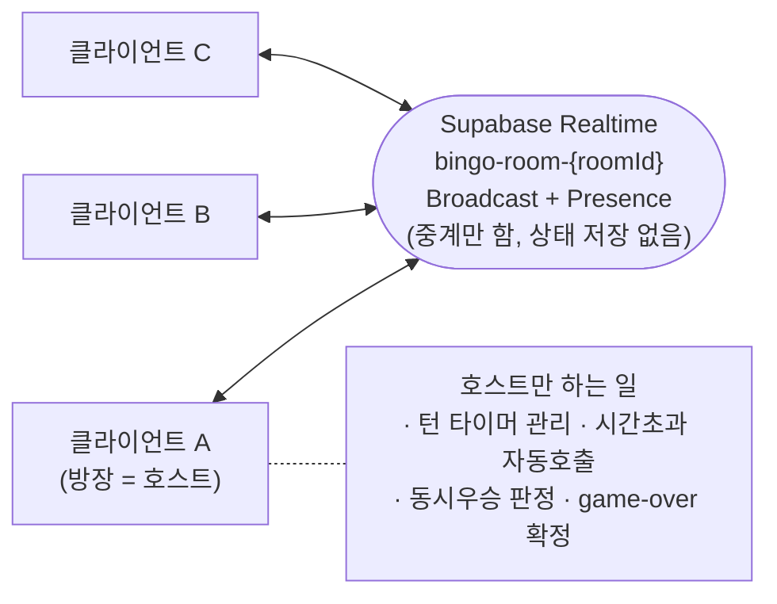
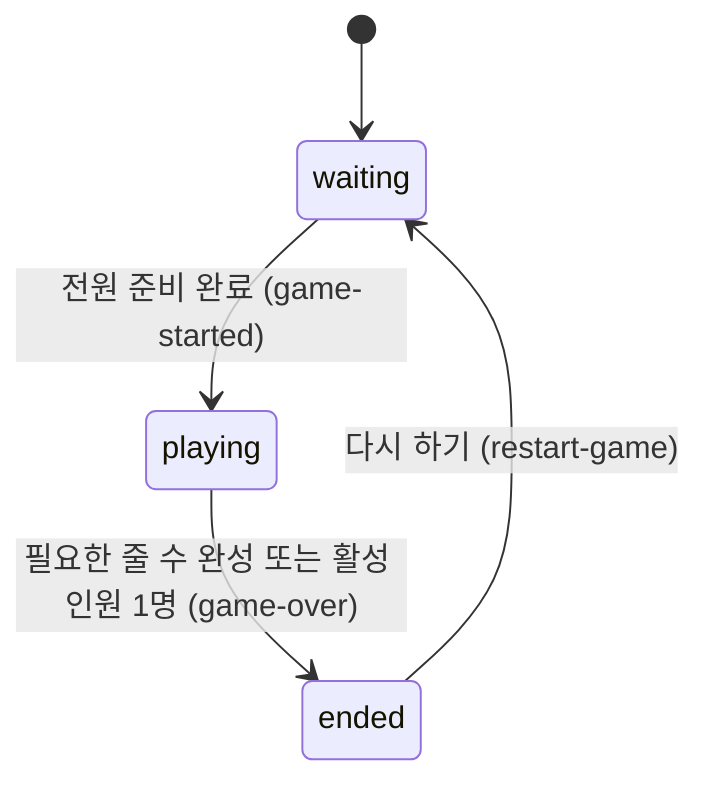
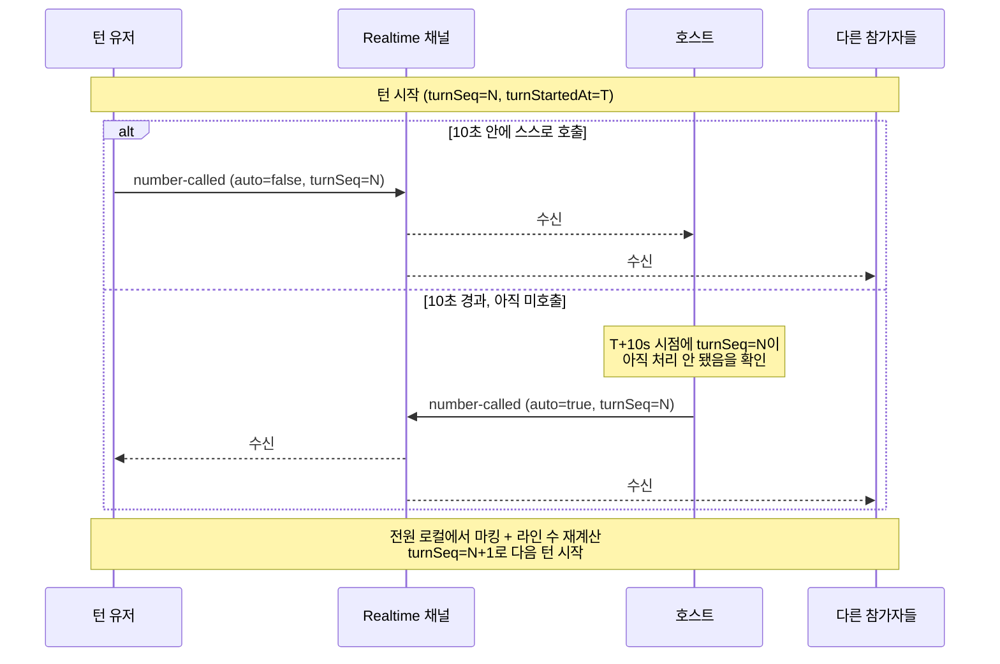
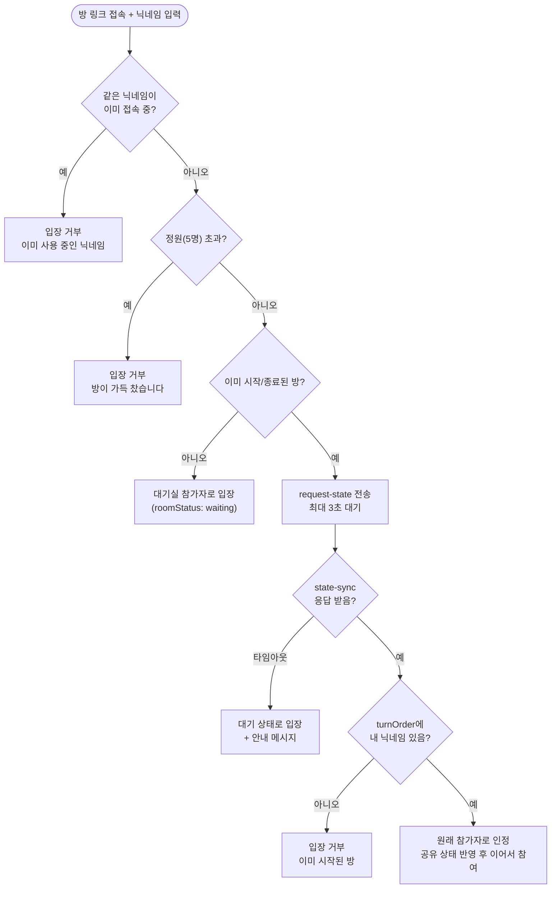

웹 기반 멀티플레이어 빙고 게임 프로토타입을 만들어줘. 아래 스펙대로 구현해줘.

## 기술 스택
- 프론트엔드: React (Vite)
- 실시간 통신: Supabase Realtime (Broadcast + Presence). 별도 게임 서버(백엔드) 없음
- 데이터 저장: 서버 DB 없음. 각 클라이언트가 로컬 상태를 원본으로 계산하고, 새로고침/전원 퇴장 시 초기화
- 프로토타입이므로 로그인/인증 없이 닉네임 기반으로만 진행

## 실시간 동기화 원칙
각 클라이언트가 자신의 빙고판과 마킹 상태를 로컬에서 직접 생성·계산하고, "숫자가 호출됐다" 같은 이벤트만 Supabase Realtime을 통해 방 전체에 중계받는다. 즉 Supabase는 상태의 원본 소스가 아니라 이벤트를 중계하는 역할만 한다.

턴 타이머 관리, 자동 호출, 최종 승자 확정처럼 "누군가 한 명은 대표로 계산해야 하는" 로직은 **방장(호스트) 클라이언트**가 맡는다.
- 호스트 = 방을 최초로 만든 사람(= Presence 입장 시각이 가장 이른 사람).
- 호스트가 연결을 끊으면, 남은 인원 중 입장 시각이 가장 이른 사람이 자동으로 새 호스트가 된다. 모든 클라이언트가 동일한 Presence 목록을 보므로 별도 합의 절차 없이 각자 동일하게 계산할 수 있다.
- 각 클라이언트는 본인의 라인 완성 여부까지는 직접 계산해 `bingo-completed`로 알리고, 여러 명이 동시에 완성했을 때 "누가 최종 우승자인가"만 호스트가 정리해서 `game-over`로 확정 발표한다.

## 전체 흐름

1. **방 만들기**
   - 첫 유저(방장)가 보드 크기(3x3 / 4x4 / 5x5 / 6x6 / 7x7, 기본값 5x5)를 고르고 "방 만들기" 버튼을 누르면 클라이언트에서 고유한 room ID를 생성한다.
   - 보드 크기는 서버가 없어 별도로 동기화할 방법이 없으므로, 초대 링크의 쿼리 파라미터로 고정해서 전달한다(예: `https://.../room/{roomId}?size=5`). 이 링크로 들어오는 모든 참가자는 URL만 보고 동일한 보드 크기를 쓰게 된다 — 방장이 크기를 고르고 나면 그 뒤로는 별도 협상 없이 링크 하나로 끝난다.
   - 방장은 닉네임을 입력한 뒤 `bingo-room-{roomId}` 채널을 구독하며 입장한다. 공유 가능한 초대 링크(크기 파라미터 포함)가 표시된다.
   - 보드 크기별 승리 조건(완성해야 하는 줄 수):

     | 보드 크기 | 총 칸 수 / 숫자 범위 | 전체 라인 수(가로+세로+대각선2) | 승리 조건 |
     |---|---|---|---|
     | 3x3 | 9칸, 1~9 | 8줄 | 1줄 완성 |
     | 4x4 | 16칸, 1~16 | 10줄 | 2줄 완성 |
     | 5x5 | 25칸, 1~25 | 12줄 | 3줄 완성 |
     | 6x6 | 36칸, 1~36 | 14줄 | 4줄 완성 |
     | 7x7 | 49칸, 1~49 | 16줄 | 5줄 완성 |

2. **입장**
   - 다른 유저는 링크로 접속하면 닉네임 입력 화면이 뜨고, 입력 후 같은 채널을 구독하며 입장한다.
   - 방 정원은 최대 5명. 채널을 구독하기 전에 현재 Presence 상태를 조회해 이미 5명이면 "방이 가득 찼습니다" 안내와 함께 입장을 막는다.
   - 이미 게임이 시작된 방(Presence로 공유되는 진행 상태가 `playing`/`ended`)에는 입장할 수 없다(관전 기능은 프로토타입에서 제외).
   - 닉네임은 방 안에서 유일해야 한다(Presence key로 쓰이기 때문). 채널을 구독하기 전에 현재 Presence 목록에 같은 닉네임이 있으면 "이미 사용 중인 닉네임입니다" 안내와 함께 입장을 막고 다른 닉네임을 입력하게 한다. 같은 사람이 실수로 다른 탭/기기에서 같은 닉네임으로 다시 들어오려는 경우도 동일하게 막는다(먼저 연결된 탭을 닫아야 재입장 가능).
   - 참가자가 0명인 방(아무도 Presence에 없음)에 입장하는 것은 오류가 아니라 정상 동작이다 — 이 경우 입장한 사람이 사실상 새로 방을 시작하는 것과 같다(대기 상태부터 시작). 이전에 그 방에서 어떤 게임이 진행됐든 서버에 남아있는 기록은 없다.

3. **대기실 / 빙고판 세팅 화면**
   - 화면은 좌우 2분할: 왼쪽 = 본인 빙고판(방 만들기에서 고른 크기), 오른쪽 = 실시간 채팅창.
   - 유저는 1~(가로세로 칸수)² 숫자를 자신이 원하는 칸에 자유롭게 배치한다. 두 가지 순서 모두 가능하다: 숫자를 먼저 클릭하고 빈 칸을 클릭하거나, 빈 칸을 먼저 클릭해 "다음 숫자를 넣을 자리"로 선택해두고 숫자를 클릭한다.
   - 그 범위의 숫자를 전부, 중복 없이 모든 칸에 채워야 "준비 완료" 처리된다. 유효성 검증은 각자 클라이언트에서 수행한다.
   - 준비 완료 시 본인 Presence 메타데이터를 `isReady: true`로 갱신해 전원에게 공유한다. 참가자 목록에 각 유저의 준비 상태(대기중/완료)를 표시한다.
   - 준비 완료 후에도 게임이 시작되기 전까지는 숫자 배치를 다시 바꿀 수 있다. 단, 배치를 변경하는 순간 본인 Presence의 `isReady`는 자동으로 `false`로 되돌아가며, 모든 칸을 다시 유효하게 채우고 준비 완료를 눌러야 다시 `true`가 된다.
   - 방에 있는 모든 인원(최소 2명 이상)의 Presence가 `isReady: true`가 되면, 이를 감지한 호스트가 `game-started` 이벤트를 broadcast해 게임을 시작시킨다. 턴 순서는 Presence 입장 시각(오름차순) 기준으로 모든 클라이언트가 동일하게 계산한다.

4. **게임 진행 (턴제)**
   - 참가자들은 입장 순서대로 턴을 갖는다.
   - 현재 턴인 유저는 10초 안에 아직 불리지 않은 숫자(1~(가로세로 칸수)²) 중 하나를 선택해 본인이 직접 `number-called`를 broadcast해야 한다(`auto: false`). 별도의 "호출 의사"만 알리는 중계 이벤트는 두지 않는다 — 어차피 턴 유저 본인만 보낼 수 있고 결과가 그대로 확정이므로, 중간 단계를 거칠 이유가 없다.
   - 10초 안에 호출하지 않으면 호스트 클라이언트가 남은 숫자 중 하나를 랜덤으로 골라 대신 `number-called`를 broadcast하고(payload에 `auto: true` 표시) 다음 턴으로 넘어간다.
   - `number-called` 이벤트를 받으면 모든 참가자가 각자 자신의 빙고판에서 해당 숫자가 있으면 로컬에서 자동으로 마킹한다.
   - 이미 호출된 숫자는 다시 호출할 수 없다(선택 불가 처리, 클라이언트에서 검증).
   - 가로/세로/대각선 2줄 전체 라인 중, 보드 크기별 승리 조건(위 "1. 방 만들기"의 표 참고 — 3x3은 1줄, 4x4는 2줄, 5x5는 3줄, 6x6은 4줄, 7x7은 5줄)을 완성하면 그 유저가 우승자가 된다. 완성 여부는 마킹 직후 각자 로컬에서 계산한다.
   - 화면에는 항상 다음 정보를 표시: 현재 턴 유저, 남은 시간(10초 카운트다운), 지금까지 호출된 숫자 목록, 각 유저의 완성 라인 수.

   **턴 진행 중 경합 처리** (별도 서버 없이 여러 클라이언트가 동시에 이벤트를 보낼 수 있어 생기는 문제)
   - 매 턴마다 증가하는 일련번호(`turnSeq`)를 두고, `number-called`에 항상 포함시킨다. 각 클라이언트는 "이번 턴의 `turnSeq`에 대해 가장 먼저 도착한 `number-called`만 인정"하고, 같은 `turnSeq`로 뒤늦게 도착하는 이벤트(턴 유저의 수동 호출과 호스트의 자동 호출이 거의 동시에 나가는 경우 등)는 무시한다.
   - `number-called`(`auto: false`, 수동 호출)는 현재 턴 유저 본인만 보낼 수 있다. 각 클라이언트는 스스로 숫자를 호출하기 전에 "나 == 현재 턴 유저"인지 로컬에서 검증하고, 아니면 애초에 보내지 않는다(수신 측 별도 검증은 두지 않음 — 신뢰 기반 캐주얼 게임이라는 전제는 `docs/decisions/0001-supabase-realtime-통신.md` 참고).
   - 턴이 시작될 때(첫 턴은 `game-started`, 이후는 각 `number-called`) 시작 시각 `turnStartedAt`(타임스탬프)을 함께 broadcast한다. 각 클라이언트는 자체 카운트다운을 돌리지 않고 `turnStartedAt + 10초`를 기준으로 남은 시간을 계산한다. 이렇게 해야 호스트가 중간에 바뀌어도(아래 "예외 처리" 참고) 남은 시간이 어긋나지 않는다.

5. **게임 종료**
   - 자신의 보드가 보드 크기별 필요한 줄 수를 완성한 클라이언트는 즉시 `bingo-completed`를 broadcast한다.
   - 호스트는 같은 `number-called` 라운드에서 들어오는 `bingo-completed` 이벤트를 짧은 유예 시간(약 300ms) 동안 모아 동시 달성 여부를 판단한 뒤, 최종 우승자(단독 또는 복수)를 `game-over`로 확정 broadcast한다. 이 즉시 게임이 종료된다.
   - `game-over` payload에는 우승자 id 목록만 담긴다. 호스트는 다른 참가자의 보드를 갖고 있지 않으므로, `game-over`를 받은 각 클라이언트가 곧바로 자신의 보드를 `board-revealed`로 broadcast한다 — 이걸 전원이 모으면 결과적으로 모든 참가자의 보드가 공개된다(마스킹 해제).
   - "🎉 {닉네임}님이 우승했습니다!" 형태의 종료 메시지를 모달 또는 배너로 표시한다. 동시 달성 시 공동 우승으로 표시한다.
   - 게임 종료 후에는 "다시 하기" 버튼을 누른 사람이 `restart-game`을 broadcast해 같은 방에서 새 게임을 시작할 수 있게 한다(빙고판 초기화 → 다시 세팅 단계로).

6. **채팅**
   - 화면 오른쪽에는 게임 시작 전/후 내내 사용 가능한 실시간 채팅창이 있다.
   - 닉네임 + 메시지 + 타임스탬프 형식으로 표시. `chat-message` broadcast를 수신 순서대로 쌓는다.

## 데이터 모델 (참고용)

아래 `Room`은 서버에 저장되는 객체가 아니라, 각 클라이언트가 **Presence 상태 + 그동안 수신한 broadcast 이벤트**를 조합해 로컬 메모리에 구성하는 뷰(view)다.

Room {
  roomId: string
  boardSize: 3 | 4 | 5 | 6 | 7   // 방 만들기 시 고정, 초대 링크의 ?size= 쿼리 파라미터로 전달(Realtime과 무관)
  players: Player[]  // 최대 5명, Presence 기반
  status: 'waiting' | 'playing' | 'ended'
  currentTurnIndex: number   // 현재 턴인 player의 순번(입장 순서 기준 인덱스)
  turnSeq: number            // 턴이 진행될 때마다 1씩 증가. number-called 중복/경합 판별에 사용
  turnStartedAt: number      // 현재 턴이 시작된 시각(타임스탬프). 10초 카운트다운 기준
  calledNumbers: number[]
  winner: Player | Player[] | null
  chatMessages: ChatMessage[]
}

Player {
  id: string (Presence key, 닉네임 기반)
  nickname: string
  board: number[][] | null   // boardSize x boardSize, null이면 아직 세팅 중
  markedNumbers: number[]
  isReady: boolean
  completedLines: number
  joinedAt: number   // Presence 입장 시각, 턴 순서와 호스트 판단에 사용
}

## Supabase Realtime 이벤트 (참고용, 필요시 이름 조정 가능)

채널: `bingo-room-{roomId}`, `config.presence.key`는 닉네임(또는 닉네임 기반 고유 id).

**Presence**
- `presence.sync` / `presence.join` / `presence.leave`: 참가자 입장/퇴장, 인원수, 방장 판단, 준비 상태(`isReady`) 공유에 사용.

**Broadcast (본인 보드 제출)**
- `set-board`: 본인이 배치한 보드(1~(가로세로 칸수)²)를 로컬 검증 후 Presence 메타데이터로 반영(중복/누락 시 로컬에서 에러 처리, 별도 이벤트 없이 제출 자체를 막음).

**Broadcast (게임 진행)**
- `game-started` (호스트 → 전체): 전원 준비 완료 감지 시 턴 순서, 첫 턴의 `turnSeq`(=1), `turnStartedAt`과 함께 broadcast.
- `number-called` (턴 유저 본인 → 전체, 자동 호출 시에는 호스트): 호출된 숫자, `auto` 여부, 그 턴의 `turnSeq`, 다음 턴의 `turnStartedAt` 포함. 수신 측은 같은 `turnSeq`로 중복 도착한 이벤트를 무시한다. 별도의 `call-number` 중계 이벤트는 두지 않는다(위 "턴 진행 중 경합 처리" 참고).
- `bingo-completed` (완성한 유저 → 전체): 본인의 완성 라인 수, 완성 시점의 `turnSeq` 포함(호스트가 동일 라운드 여부 판단에 사용).
- `game-over` (호스트 → 전체): 최종 우승자 id 목록(단독/복수) 포함. 보드 데이터는 없다 — 호스트가 다른 참가자의 보드를 갖고 있지 않기 때문.
- `board-revealed` (각 참가자 본인 → 전체): `game-over`를 받은 직후 각자 자신의 보드를 공개. 전원의 것이 모이면 "모든 참가자 보드 공개"가 된다.
- `restart-game` (아무나 → 전체): 방 상태 초기화 트리거.

**Broadcast (채팅/기타)**
- `chat-message`: 닉네임 + 메시지 + 타임스탬프.
- `request-state` / `state-sync`: 재접속·새로고침한 클라이언트가 현재 상태를 요청하면, 그 시점에 `roomStatus`가 `waiting`이 아닌 클라이언트 누구든(방장 우선이 아니라 "아는 사람 아무나") `state-sync`로 응답한다. 여러 명이 동시에 응답해도 내용은 서로 같으므로 먼저 도착한 응답만 채택하고 나머지는 무시한다. `state-sync` payload에는 `players`(Presence로 이미 동기화됨)를 뺀 `roomStatus`/`turnOrder`/`turnSeq`/`turnStartedAt`/`calledNumbers`/`winnerIds`/`revealedBoards`만 담는다.

## UI 요구사항

> (2026-09-30 기준 갱신) 아래는 처음 이 스펙을 작성할 때의 요구사항이었고, 실제 구현은 이후 모바일 사용성/PWA/테마 작업을 거치며 더 나아갔다. 현재 실제 UI는 이렇다:
> - 카카오톡 공유가 주 진입 경로라 **모바일 우선**으로 만들었다. 넓은 화면(lg 이상)은 좌: 빙고판 / 우: 채팅 2분할, 좁은 화면은 채팅을 우측 하단 플로팅 버튼 + 반투명 바텀시트로 열고 닫는다.
> - 타이틀 화면과 게임 화면 전체가 다크 테마(slate-950~900 그라데이션 + emerald 강조색)로 통일돼 있다.
> - `vite-plugin-pwa`로 "홈 화면에 추가" 설치를 지원한다(오프라인 플레이는 지원 안 함 — Realtime 연결이 필요하기 때문).
> - 턴 타이머는 원형 뱃지로 크게 표시하고, 3초 이하로 남으면 빨간색+깜빡임으로 강조한다.
> - 게임 종료 화면에서 우승자의 보드는 에메랄드 대신 황금색으로 강조된다.
>
> 아래는 원래 요구사항(참고용으로 남겨둠):

- 좌: 빙고판(세팅 단계엔 숫자 배치용, 게임 단계엔 마킹 표시), 우: 채팅 + 참가자 목록/턴 정보.
- 턴 타이머는 시각적으로 눈에 띄게(카운트다운 숫자 또는 프로그레스 바).
- 최소한의 스타일링은 하되 화려한 디자인은 프로토타입 단계에서 생략 가능.

## 예외 처리

**입장/닉네임**
- 이미 사용 중인 닉네임으로 입장을 시도하면 막고, 다른 닉네임을 입력하게 한다(같은 사람이 다른 탭으로 재입장하려는 경우 포함).
- 참가자가 0명인 방에 입장하는 것은 정상이며, 그 사람이 대기 상태부터 새로 시작하는 것과 동일하게 취급한다(서버에 남은 이전 기록 없음).

**세팅 단계**
- 숫자를 중복 배치하거나 보드 칸을 다 못 채운 상태로 준비 완료를 누르면 클라이언트에서 에러 메시지 표시(제출 자체를 막음).
- 준비 완료 후 배치를 다시 바꾸면 `isReady`가 자동으로 `false`로 풀린다(위 "3. 대기실/빙고판 세팅 화면" 참고).
- 세팅 단계에서 유저가 나가면 그냥 참가자 목록에서 제외된다. 남은 인원이 1명 이하가 되면 "게임 시작" 조건(최소 2명)을 만족하지 못하므로 자동으로는 시작되지 않고 대기 상태를 유지한다.

**게임 진행 중 이탈**
- 게임 중 유저 접속 종료(Presence `leave` 감지) 시: 해당 유저는 자동 기권 처리(더 이상 턴을 받지 않고, 라인 완성 여부 계산에서도 제외)하고 나머지 인원으로 게임을 계속 진행한다.
- 이탈로 인해 활성 참가자가 1명만 남으면, 호스트가 그 즉시 남은 1명을 단독 우승자로 하는 `game-over`를 broadcast하며 게임을 종료한다(1명으로는 턴을 진행할 상대가 없으므로).
- 방장(호스트)이 나가도 방은 유지된다 — Presence 입장 시각 기준으로 다음 순번이 자동으로 새 호스트가 된다. 새 호스트는 마지막으로 수신한 `turnStartedAt`을 기준으로 남은 턴 시간을 이어서 계산하며, 타이머를 처음부터 다시 시작하지 않는다.

**동시성/경합**
- 턴 유저의 수동 호출과 호스트의 시간 초과 자동 호출이 거의 동시에 발생해 서로 다른 두 개의 `number-called`가 나가는 경우, 각 클라이언트는 해당 턴의 `turnSeq` 기준으로 가장 먼저 수신한 이벤트만 반영하고 나머지는 무시한다.
- 두 명 이상이 같은 라운드에서 동시에 필요한 줄 수를 완성해 `bingo-completed`가 여러 건 도착하면, 호스트는 약 300ms 유예 시간 동안 모은 뒤 공동 우승으로 확정한다(위 "5. 게임 종료" 참고).

**재접속/네트워크**
- 닉네임과 내가 배치한 보드는 `localStorage`에도 저장해둔다. 방/게임 상태(Presence·broadcast)는 재접속하면 다시 받을 수 있지만, 내 보드 배치는 아무에게도 공유한 적이 없어서(게임 종료 전까지는 비공개) 같은 브라우저의 로컬 저장소 말고는 복구할 방법이 없기 때문이다. 다른 브라우저/기기로 새로 들어오면 이 복구는 적용되지 않고 처음부터 다시 배치해야 한다.
- 새로고침한 클라이언트는 저장해둔 닉네임으로 자동 재입장을 시도한다. 방이 이미 `playing`/`ended` 상태면(Presence로 판단) 곧바로 참가자로 반영하지 않고 `request-state`를 보내 다른 클라이언트의 응답(`state-sync`)을 기다린다.
  - 응답에 담긴 `turnOrder`에 내 닉네임이 있으면 원래 참가자로 인정하고, 받은 상태(호출된 숫자·턴 정보 등)를 그대로 반영해 이어서 참여한다.
  - `turnOrder`에 없으면(진짜 낯선 사람이 시작된 방에 들어오려는 경우) 입장을 막는다 — "이미 시작된 방" 처리와 동일.
  - 일정 시간(약 3초) 안에 `state-sync` 응답이 없으면(모두가 동시에 새로고침한 극단적인 경우 등) 검증할 방법이 없으므로, "다른 참가자의 상태를 불러올 수 없습니다" 안내와 함께 새로 시작하는 것으로 간주하고 대기 상태로 입장시킨다.

**입장 판단 흐름 요약** (닉네임 중복 → 정원 → 이미 시작된 방 → 재접속 여부까지 한 번에)

먼저 Supabase 채널 구독·Presence·클라이언트 상태 동기화 로직부터 만들고, 그 다음 프론트엔드 화면(방 만들기 → 대기실/보드 세팅 → 게임 진행 → 종료)을 순서대로 구현해줘. 구현 중간중간 진행 상황을 알려줘.

---

이 스펙을 실제로 구현하는 단계별 순서와 완료 기준은 [[개발프로세스]] 참고.
